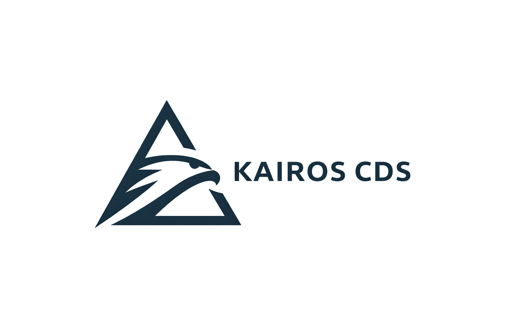

<p align="center">
  
</p>

<h1 align="center">KAIROS CDS</h1>
<h3 align="center">Digital Twin for Emergency Fleet Management</h3>

<p align="center">
  
  
  
  
  
  
  
  
  
  
</p>

<p align="center">
  Real-time simulation, monitoring, and optimization of emergency ambulance fleets<br/>
  powered by <strong>10 AI modules</strong>, <strong>blockchain auditing</strong>, and <strong>enterprise-grade security</strong>.
</p>

---

## Overview

KAIROS CDS is a **digital twin platform** that simulates and manages emergency medical service (EMS) fleets in real-time. It combines artificial intelligence, geospatial tracking, blockchain-based audit trails, and a comprehensive cybersecurity layer into a single, production-ready system.

<table>
<tr>
<td width="50%">

**Core Capabilities**
- Real-time vehicle tracking on interactive maps
- AI-powered incident classification and demand prediction
- Automatic ambulance dispatch optimization
- Hospital occupancy monitoring
- Blockchain-notarized audit trail (BSV mainnet)
- Full cybersecurity suite with real-time threat detection

</td>
<td width="50%">

**Project Metrics**
| Metric | Value |
|--------|-------|
| API Endpoints | 134 REST + 1 WebSocket |
| AI Modules | 10 (100% local, sklearn) |
| Frontend Pages | 15 |
| Database Models | 18 tables |
| Docker Services | 6 |
| Test Suites | 13 (72+ tests) |
| Security Score | 8.5/10 |

</td>
</tr>
</table>

---

## Quick Start

> **Prerequisites:** [Docker Desktop](https://www.docker.com/products/docker-desktop/) + [Python 3.10+](https://www.python.org/downloads/)

```bash
git clone https://github.com/JuanmPalencia/KAIROS_CDS.git
cd KAIROS_CDS
python3 run_all.py
```

**That's it.** The script handles everything: Docker services, database initialization, data seeding, and incident auto-generation.

| Command | Description |
|---------|-------------|
| `python3 run_all.py` | Start all services (preserves existing data) |
| `python3 run_all.py --reset` | Full reset with confirmation |
| `python3 run_all.py --security` | Run cyber-claude security scan |
| `python3 run_all.py --logs` | View live service logs |
| `python3 run_all.py --stop` | Stop all services |

### Access

| Service | URL |
|---------|-----|
| **Dashboard** | [http://localhost:5173](http://localhost:5173) |
| **API Docs (Swagger)** | [http://localhost:5001/docs](http://localhost:5001/docs) |
| **Prometheus** | [http://localhost:9090](http://localhost:9090) |
| **Alertmanager** | [http://localhost:9093](http://localhost:9093) |

### Default Credentials

| User | Password | Role |
|------|----------|------|
| `admin` | `admin123` | ADMIN — Full access |
| `operator` | `operator123` | OPERATOR — Dispatch |
| `doctor` | `doctor123` | DOCTOR — Clinical |
| `viewer` | `viewer123` | VIEWER — Read-only |

---

## Architecture

```
                          +-------------------+
                          |   React 19 SPA    |
                          |   (Leaflet Maps)  |
                          +--------+----------+
                                   |
                          +--------v----------+
                          |   FastAPI Backend  |
                          |   134 endpoints    |
                          +--------+----------+
                                   |
              +--------------------+--------------------+
              |                    |                    |
    +---------v------+   +--------v-------+   +--------v--------+
    | PostgreSQL 16  |   |   Redis 7      |   | BSV Blockchain  |
    | + PostGIS      |   |   (cache/pub)  |   | (WhatsOnChain)  |
    +----------------+   +----------------+   +-----------------+
```

| Layer | Technology | Purpose |
|-------|-----------|---------|
| **Frontend** | React 19 + Leaflet + Recharts | Real-time dashboard, maps, analytics |
| **Backend** | FastAPI + SQLAlchemy + Pydantic | REST API, WebSocket, business logic |
| **AI Engine** | scikit-learn (6 trained + 4 rule-based) | Classification, prediction, anomaly detection |
| **Database** | PostgreSQL 16 + PostGIS | Geospatial data, 18 relational tables |
| **Cache** | Redis 7 | Session management, pub/sub, rate limiting |
| **Blockchain** | BSV + Merkle Trees | Immutable audit trail via WhatsOnChain |
| **Monitoring** | Prometheus + Alertmanager | Metrics collection, alerting rules |
| **Security** | Custom middleware stack | JWT, RBAC, encryption, threat detection |

---

## AI Modules

All models run **locally** with scikit-learn. No external API dependencies (no OpenAI, no cloud ML).

| # | Module | Algorithm | Purpose |
|---|--------|-----------|---------|
| 1 | **Severity Classifier** | TF-IDF + RandomForest | Classify incident severity (LOW/MEDIUM/HIGH/CRITICAL) |
| 2 | **Chat Assistant** | TF-IDF + LogisticRegression | Natural language intent detection for operator chat |
| 3 | **Vision Analyzer** | TF-IDF + LinearSVC | Emergency scene classification from descriptions |
| 4 | **Demand Predictor** | RandomForest Regressor | Predict incident hotspots by zone/time |
| 5 | **ETA Predictor** | GradientBoosting Regressor | Estimate ambulance arrival times |
| 6 | **Anomaly Detector** | IsolationForest | Detect unusual vehicle/incident patterns |
| 7 | **Maintenance Predictor** | Rule-based | Predict vehicle maintenance needs |
| 8 | **Traffic Integration** | Rule-based | Real-time traffic factor estimation |
| 9 | **Recommendation Engine** | Profile-based | Personalized operator suggestions |
| 10 | **Assignment Optimizer** | Multi-criteria scoring | Optimal vehicle-to-incident matching |

**Train models:**
```bash
cd backend && python train_all_models.py
```

---

## Security

KAIROS CDS achieves an **8.5/10 security rating** (audited by [cyber-claude](./cyber-claude/)):

| Feature | Implementation |
|---------|---------------|
| **Authentication** | JWT + OAuth2 with HIBP password breach detection |
| **Authorization** | RBAC with 4 roles and 22 granular permissions |
| **Encryption** | AES-256-GCM for PII fields + PBKDF2 password hashing |
| **Brute-force Protection** | 5 attempts/min lockout with progressive delays |
| **Rate Limiting** | 5 tiers (global, per-user, per-endpoint, burst, auth) |
| **Security Headers** | 11+ headers (HSTS, CSP, X-Frame-Options, CORP, COOP) |
| **Input Scanning** | SQLi, XSS, path traversal detection on all inputs |
| **Audit Trail** | Blockchain-notarized logs (BSV mainnet + Merkle batching) |
| **Anomaly Detection** | IP-based + time-based behavioral analysis |

---

## Blockchain

Audit logs are notarized on the **BSV mainnet** using OP_RETURN transactions with Merkle tree batching for cost efficiency.

- **Broadcast:** ARC API (gorillapool.io)
- **Verification:** [WhatsOnChain](https://whatsonchain.com)
- **Cost:** ~$0.01/day for 1000+ audit logs (Merkle batching)
- **Fallback:** Local JSONL ledger when offline

---

## Project Structure

```
KAIROS_CDS/
├── backend/
│   ├── app/
│   │   ├── api/              # 21 routers (134 endpoints)
│   │   ├── auth/             # JWT + RBAC
│   │   ├── blockchain/       # BSV adapter + Merkle trees
│   │   ├── core/             # 10 AI modules + TwinEngine
│   │   ├── storage/          # SQLAlchemy models + repos
│   │   └── main.py
│   ├── datasets/             # Training data (CSV)
│   ├── models/               # Trained ML models (.joblib)
│   ├── tests/                # 11 test suites
│   └── train_all_models.py   # One-command model training
├── frontend/
│   ├── src/
│   │   ├── pages/            # 15 pages
│   │   ├── components/       # Reusable components
│   │   ├── styles/           # 18 CSS files
│   │   └── config.js         # API configuration
│   └── Dockerfile
├── cyber-claude/             # Integrated security analysis tool
├── monitoring/               # Prometheus + Alertmanager configs
├── docker-compose.yml
├── run_all.py                # Single entry point
├── FICHA_TECNICA_KAIROS_CDS.md  # Full technical specification
└── README.md
```

---

## Documentation

| Document | Description |
|----------|-------------|
| [`FICHA_TECNICA_KAIROS_CDS.md`](./FICHA_TECNICA_KAIROS_CDS.md) | Complete technical specification (30 sections) |
| [`cyber-claude/README.md`](./cyber-claude/README.md) | Security analysis tool documentation |
| [`localhost:5001/docs`](http://localhost:5001/docs) | Interactive API documentation (Swagger) |

---

## Tech Stack

<p>
  
  
  
  
  
  
  
  
  
  
</p>

---

## License

MIT License. See [LICENSE](./LICENSE) for details.

---

<p align="center">
  <strong>KAIROS CDS</strong> — Built for emergency management professionals<br/>
  <sub>HPE GreenLake CDS Challenge 2026</sub>
</p>
